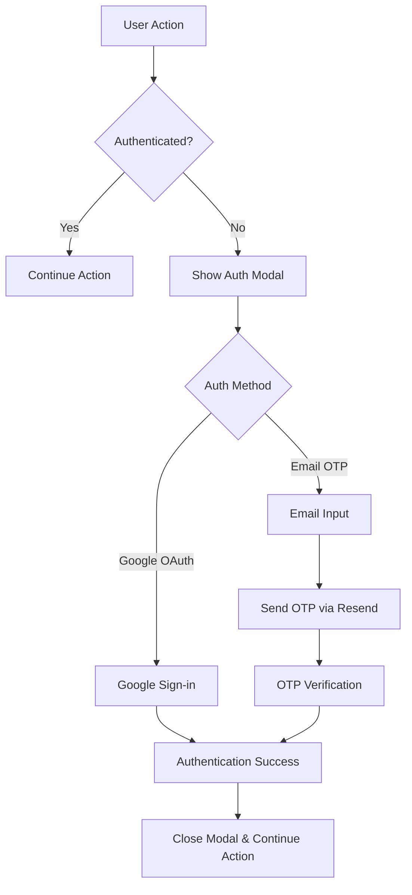
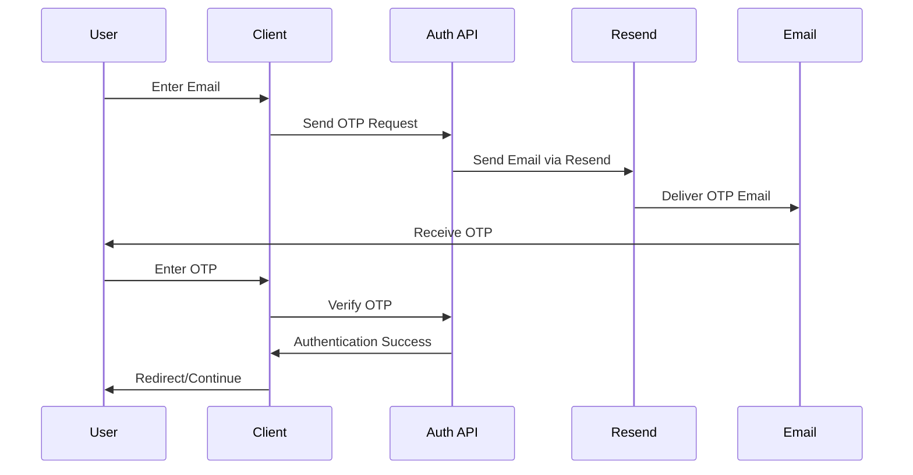

# Design Document

## Overview

This design enhances the existing Better Auth implementation by integrating email OTP authentication via Resend, creating a modal-based authentication system, and fixing environment variable references. The solution maintains the current Google OAuth functionality while adding email-based authentication options and improving user experience through contextual authentication prompts.

## Architecture

### Authentication Flow Architecture



### Email OTP Flow



## Components and Interfaces

### 1. Better Auth Configuration Enhancement

**File**: `lib/auth.ts`

- Add email OTP plugin to existing Better Auth configuration
- Configure Resend as email provider
- Maintain existing Google OAuth configuration

```typescript
// Enhanced auth configuration
export const auth = betterAuth({
  database: drizzleAdapter(db, {
    provider: "pg",
    schema: { ...schema },
  }),
  socialProviders: {
    google: {
      clientId: process.env.GOOGLE_CLIENT_ID!,
      clientSecret: process.env.GOOGLE_CLIENT_SECRET!,
    },
  },
  plugins: [
    emailOTP({
      async sendVerificationOTP({ email, otp, type }) {
        // Resend integration for sending OTP emails
      },
    }),
  ],
});
```

### 2. Authentication Modal Component

**File**: `app/auth/_components/auth-modal.tsx`

- Reusable modal component for authentication
- Supports both Google OAuth and Email OTP
- Consistent styling with existing theme system
- Portal-based rendering for proper z-index management

**Props Interface**:

```typescript
interface AuthModalProps {
  isOpen: boolean;
  onClose: () => void;
  onSuccess?: () => void;
  title?: string;
}
```

### 3. Email OTP Form Component

**File**: `app/auth/_components/email-otp-form.tsx`

- Two-step form: email input → OTP verification
- Loading states and error handling
- Resend OTP functionality with cooldown
- Consistent with existing form styling

**State Management**:

```typescript
interface EmailOTPState {
  step: "email" | "otp";
  email: string;
  otp: string;
  isLoading: boolean;
  error: string | null;
  canResend: boolean;
  countdown: number;
}
```

### 4. Enhanced Authentication Form

**File**: `app/auth/_components/form.tsx`

- Add email OTP option alongside Google OAuth
- Shared component logic between modal and page
- Consistent error handling and loading states

### 5. Authentication Guard Hook

**File**: `lib/hooks/use-auth-guard.ts`

- Custom hook to check authentication status
- Triggers modal when unauthenticated user attempts protected actions
- Returns authentication state and modal controls

```typescript
interface UseAuthGuardReturn {
  isAuthenticated: boolean;
  showAuthModal: boolean;
  openAuthModal: () => void;
  closeAuthModal: () => void;
  requireAuth: (action: () => void) => void;
}
```

## Data Models

### Email OTP Storage

Better Auth handles OTP storage internally through its plugin system. The email OTP plugin creates necessary database tables for:

- OTP codes with expiration timestamps
- Email verification status
- Rate limiting data

### Session Management

Existing session management remains unchanged:

- User sessions stored via Better Auth
- Session tokens handled by auth client
- Automatic session refresh and validation

## Error Handling

### Email Service Errors

```typescript
interface EmailServiceError {
  type: "RATE_LIMIT" | "INVALID_EMAIL" | "SERVICE_UNAVAILABLE";
  message: string;
  retryAfter?: number;
}
```

**Error Scenarios**:

1. **Rate Limiting**: Resend API limits exceeded
2. **Invalid Email**: Email format validation failures
3. **Service Unavailable**: Resend service downtime
4. **Network Errors**: Connection failures

### OTP Validation Errors

```typescript
interface OTPValidationError {
  type: "INVALID_OTP" | "EXPIRED_OTP" | "MAX_ATTEMPTS";
  message: string;
  remainingAttempts?: number;
}
```

**Error Scenarios**:

1. **Invalid OTP**: Incorrect code entered
2. **Expired OTP**: Code past expiration time
3. **Max Attempts**: Too many failed attempts
4. **Missing OTP**: No active OTP for email

### Modal State Errors

- Handle authentication failures gracefully
- Prevent modal from closing on network errors
- Show appropriate retry options
- Maintain form state during errors

## Testing Strategy

### Unit Tests

**Authentication Components**:

- Modal open/close behavior
- Form validation logic
- Error state handling
- Loading state management

**Email OTP Flow**:

- OTP generation and validation
- Email sending functionality
- Rate limiting behavior
- Expiration handling

### Integration Tests

**Authentication Flow**:

- Complete Google OAuth flow
- Complete Email OTP flow
- Modal trigger scenarios
- Session persistence

**API Endpoints**:

- OTP sending endpoint
- OTP verification endpoint
- Error response handling
- Rate limiting enforcement

### E2E Tests

**User Journeys**:

- Unauthenticated user triggers modal
- Successful authentication via modal
- Authentication failure scenarios
- Modal cancellation behavior

**Cross-browser Testing**:

- Modal rendering consistency
- Authentication flow compatibility
- Email client OTP display

## Environment Configuration

### Required Environment Variables

```bash
# Existing Better Auth configuration
BETTER_AUTH_SECRET="existing_secret"
BETTER_AUTH_URL="http://localhost:3000"

# Existing Google OAuth
GOOGLE_CLIENT_ID="existing_client_id"
GOOGLE_CLIENT_SECRET="existing_client_secret"

# Resend configuration (already available)
RESEND_API_KEY="re_existing_key"
```

### Environment Variable Migration

**Files to Update**:

1. `app/api/v1/code/apply/route.ts` - Replace `NEXTAUTH_URL` with `BETTER_AUTH_URL`
2. `app/api/v1/projects/[id]/chat/[chatId]/generate/route.ts` - Replace `NEXTAUTH_URL` with `BETTER_AUTH_URL`

**Migration Pattern**:

```typescript
// Before
const url = process.env.NEXTAUTH_URL || "http://localhost:3000";

// After
const url = process.env.BETTER_AUTH_URL || "http://localhost:3000";
```

## Security Considerations

### OTP Security

- **Expiration**: OTPs expire after 10 minutes
- **Rate Limiting**: Maximum 3 OTP requests per email per hour
- **Single Use**: OTPs invalidated after successful use
- **Secure Generation**: Cryptographically secure random codes

### Email Security

- **Domain Verification**: Use verified Resend domain
- **Content Security**: Sanitize email content
- **Delivery Tracking**: Monitor email delivery status
- **Bounce Handling**: Handle invalid email addresses

### Modal Security

- **XSS Prevention**: Sanitize all user inputs
- **CSRF Protection**: Use Better Auth's built-in protection
- **Session Security**: Secure session token handling
- **Input Validation**: Validate all form inputs

## Performance Considerations

### Email Delivery

- **Async Processing**: Non-blocking email sending
- **Retry Logic**: Automatic retry for failed sends
- **Caching**: Cache email templates and configurations
- **Monitoring**: Track email delivery metrics

### Modal Performance

- **Lazy Loading**: Load modal components on demand
- **Portal Rendering**: Efficient DOM manipulation
- **State Management**: Minimize re-renders
- **Memory Management**: Cleanup on unmount

### Database Performance

- **Index Optimization**: Proper indexing for OTP lookups
- **Cleanup Jobs**: Remove expired OTPs automatically
- **Connection Pooling**: Efficient database connections
- **Query Optimization**: Minimize database queries
